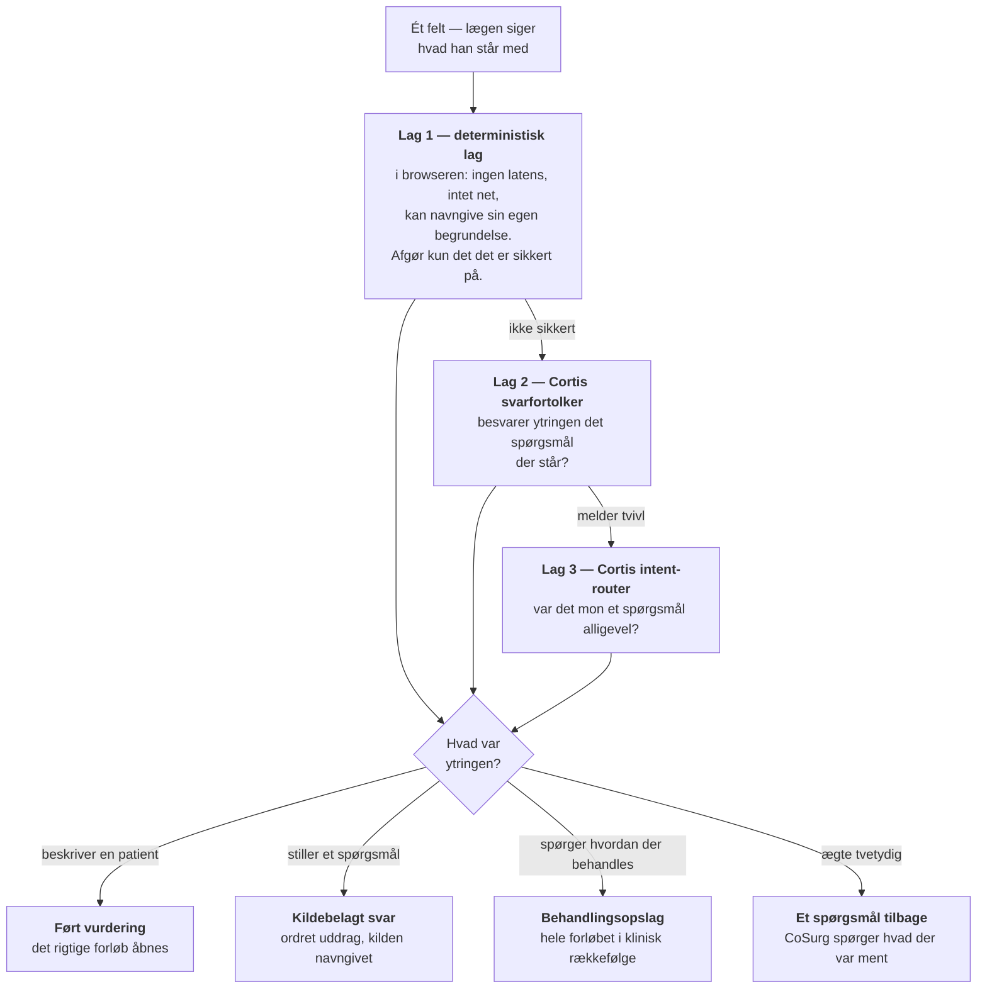
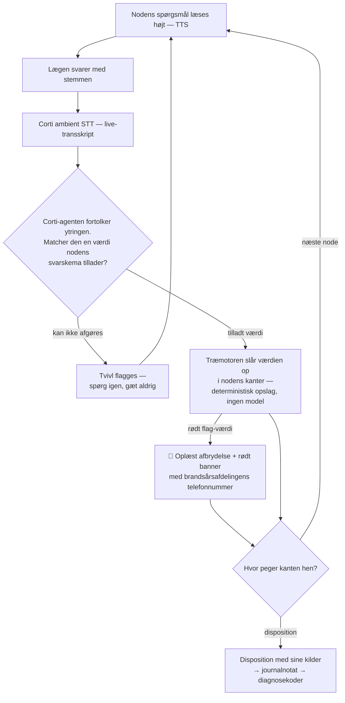
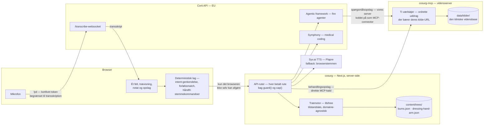
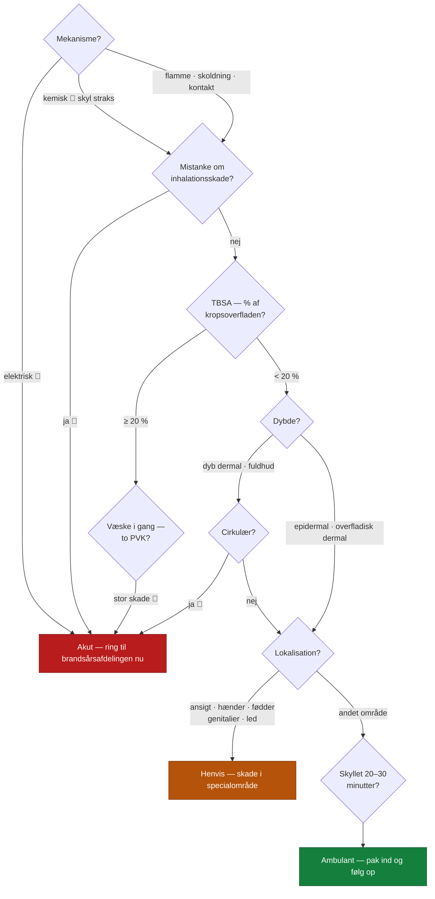

> 🇬🇧 **[Read this page in English](README.md)** — English is the primary language of this repository.

# CoSurg

**Ét felt. Lægen siger hvad han står med, og systemet finder selv ud af hvad han
har brug for — en ført vurdering, et kildebelagt svar, et behandlingsopslag eller
en advarsel. Hvert svar navngiver den kliniske kilde det kommer fra.**
Bygget på Corti API til Corti Hack for Health, København, 20.–21. august 2026.

| | |
|---|---|
| App | [cosurg.com](https://cosurg.com) |
| Vidensserver (MCP) | [mcp.cosurg.com](https://mcp.cosurg.com/health) |
| Tredjepartsprodukter og datasæt | [THIRD-PARTY.md](THIRD-PARTY.md) |

---

## Problemet

En brandsårspatient kommer ind på skadestuen. Inden den vagthavende læge kan
ringe til Rigshospitalets brandsårsafdeling, skal fem ting være afklaret.
Dansk Brandsårsforening skriver det som en instruks:

> Ved samtale med vagthavende på brandsårsafdeling er det vigtigt at fremlægge
> skadesmekanisme, skadestidspunkt, vitale parametre, vurderet brandsårsareal
> samt hvilken behandling der er iværksat.
>
> — [brandsaar.dk/overflytning-af-brandsårspatienter](https://brandsaar.dk/overflytning-af-brandsa%CC%8Arspatienter/)

Det er en tjekliste, og den er svær at holde i hovedet. Foreningen skriver selv,
at det "ofte er vanskeligt at vurdere forbrændingens nøjagtige omfang. Det kræver
ro og overblik" — ro er ikke det man har på en skadestue klokken tre om natten.

Fem vurderinger afgør forløbet, og hver af dem har en fælde:

- **Dybden** kan ikke aflæses med sikkerhed de første dage. Den skal vurderes på
  farve, kapillærrespons og sensibilitet — tre observationer, ikke ét blik.
- **Udbredelsen (TBSA)** afgør om patienten skal have væske efter Parkland. Ved
  20 % og derover ændrer hele behandlingen sig.
- **Cirkulær afsnøring** er ikke farlig når man ser den. Den bliver farlig når
  ødemet tiltager timer senere, og huden strammer perifert for skaden.
- **Inhalationsskade** kan udvikle sig til øvre luftvejsobstruktion *under
  transporten*. Beslutningen om intubation skal træffes før man kører.
- **Elektrisk skade** ser lille ud på huden. Hudlæsionen undervurderer altid
  vævsskaden nedenunder.

Ingen af dem er svære at huske. De er svære at huske *alle sammen, hver gang,
under tidspres*. Det er dét der bliver glemt — ikke viden, men fuldstændighed.

Fuldstændighed er kun den ene halvdel. Den anden melder sig i det øjeblik tvivlen
gør. Hvordan beregnes arealet på et barn? Hvor meget væske skal en mand på 80 kilo
med 30 % have? Hvad gør man egentlig ved en cirkulær forbrænding på underarmen?
Hvert af de spørgsmål sender lægen et andet sted hen — et andet system, en anden
søgning, en anden måde at spørge på — og den vurdering han var midt i, bliver til
noget han skal huske at vende tilbage til. Vores værktøjer er adskilte fordi vi
byggede dem adskilt. Det kliniske øjeblik er ikke adskilt.

## Løsningen

CoSurg er ét felt. Lægen siger hvad han står med, og systemet finder selv ud af
hvilken slags hjælp det var. At vælge værktøjet er netop dét der ikke er tid til,
så CoSurg beder ikke nogen om at vælge.

Fire ting kan komme retur, og hvilken af dem det bliver, er ikke lægens problem:

- **En ført vurdering.** Ytringen beskriver en patient, så det rigtige forløb
  åbnes, og første spørgsmål læses op. Lægens egne ord bliver første linje i
  transskriptet — beskrivelsen er en klinisk oplysning fra begyndelsen, ikke noget
  der skal skrives to gange.
- **Et kildebelagt svar.** Ytringen er et spørgsmål, så det slås op — i vores egen
  vidensbase, eller i litteraturen når den ikke rækker — og kommer tilbage med
  uddraget ordret og kilden navngivet.
- **Et behandlingsopslag.** Ytringen spørger hvordan en tilstand håndteres, så hele
  forløbet samles fra vores egne kilder i klinisk rækkefølge, afsnit for afsnit,
  hvert med sin oprindelse.
- **Et spørgsmål tilbage.** Ytringen kan læses på to måder, så CoSurg siger det og
  spørger hvad der var ment.

**Sammensmeltningen er produktet, og det øjeblik den betaler sig er midt i noget
andet.** Lægen står ved *hvor stort er arealet?* og spørger "hvordan behandler jeg
en overfladisk dermal forbrænding?" — et spørgsmål, ikke et svar, og CoSurg læser
det som et spørgsmål, fordi ingen besvarer et spørgsmål ved at indlede med
"hvordan". Opslaget lægger sig under det spørgsmål der stadig står, citerer vores
kilder med deres navne på, og nederst på kortet står *forløbet står uændret på trin
4 / 8*. Intet blev lukket, intet skal findes frem igen, og spørgsmålet kommer aldrig
i journalen som en oplysning om patienten.

Undervejs afbryder røde flag — ikke som en advarsel man kan overse, men som en
oplæst besked med telefonnummeret til vagthavende brandsårslæge. Og i håndfri
tilstand vendes forholdet om: kirurgen er steril og rører aldrig skærmen.
Mikrofonen er åben, kommandoerne er få og distinkte, og skærmen viser store
procedurefotos af hvad der konkret skal gøres i dette trin.

### Fra ytring til udfald



Hvert lag afgør kun det det er sikkert på. Tvivl falder igennem til næste lag —
og for enden af kæden bliver den spurgt om, aldrig gættet væk.

### Hvad der gør den anderledes

Det er let at bygge en chatbot der svarer på brandsårsspørgsmål. Forskellen på det
og klinisk beslutningsstøtte er ikke hvor godt den formulerer sig. Den er hvor
svaret kommer fra — og om nogen kan finde ud af det bagefter. Fem steder har vi
truffet det valg bevidst.

**Den spørger igen frem for at gætte, og det er kalibreret.**
Spørgsmål eller svar er appens farligste enkeltbeslutning. De to fejl er ikke lige
store: et svar læst som spørgsmål koster et opslag og en gentagelse, mens et
spørgsmål læst som svar rykker en klinisk beslutning på et falsk grundlag — og
efterlader intet i resultatet der viser det. Lagene er derfor ordnet efter den
skævhed. Et deterministisk lag
([`components/unified/intent.ts`](cosurg/components/unified/intent.ts)) afgør kun
det det er sikkert på, uden latens og uden net; resten falder igennem til Cortis
svarfortolker; og først når DEN melder tvivl, spørges Cortis intent-router om
ytringen mon var et spørgsmål alligevel
([`app/api/route/agent.ts`](cosurg/app/api/route/agent.ts)). Er ytringen ægte
tvetydig — "er det dybt?" sagt ved dybde-noden — standser CoSurg og spørger hvad
der var ment. Den vælger aldrig det mest sandsynlige.

Samme regel afgør hvilket forløb en ytring åbner. Genkendelsen sker i browseren
([`components/treeRouting.ts`](cosurg/components/treeRouting.ts)), så vi kan sige
præcis hvorfor: en vinder kræver både et absolut minimum og et klart forspring til
nummer to. "Jeg skal lægge forbinding på en hånd med brandsår" rammer begge forløb
— og netop dér spørger appen frem for at vælge.

**Er svaret en anbefaling, kommer det fra træet, aldrig fra en sprogmodel.**
Beslutningstræet er JSON skrevet af plastikkirurger. Motoren der kører det
([`lib/tree/engine.ts`](cosurg/lib/tree/engine.ts)) er 123 linjer rene funktioner
uden ét ord om brandsår i sig. Den slår en svarværdi op i nodens kanter og rykker
frem. En sprogmodel kan ikke ændre hvor den lander, fordi den ikke er med i det
opslag. Den førte vurdering er én af de former et svar kan tage — og det er den
form hvor determinisme betyder mest, fordi det er den der ender i en disposition.



Sprogmodellen optræder præcis én gang i sløjfen, og det eneste den kan levere
tilbage er en værdi nodens skema i forvejen tillader — eller tvivl. Alt det der
afgør — hvilken node der kommer næst, hvornår et rødt flag fyrer, hvor patienten
ender — er et opslag i JSON skrevet af plastikkirurger.

**Koderne kommer fra Cortis coding-API, ikke fra en model der finder på dem.**
En sprogmodel kan producere en ICD-10-kode der ser fuldstændig rigtig ud og ikke
findes. Beslutningsvej, transskript og diktat sendes derfor som tre adskilte
kontekster til Corti Symphony, og skribent-agenten får koderne som en fast liste
den ikke må røre. Den må skrive *hvilket trin i beslutningsvejen der understøtter
hver kode* — det er alt.

**Opslag citerer vores egne kilder, og siger til når der ikke er nogen.**
Svarene kommer fra vores egen MCP-server, som returnerer uddrag der bærer deres
kilde-URL. Er emnet ikke dækket, svarer serveren `INGEN DAEKNING I VIDENSBASEN`,
og det er dét brugeren får at se. Den falder ikke tilbage på almen viden, og går
serveren ned, siger siderne at der ikke er dækning frem for at improvisere.
Serveren nås ad to veje: behandlingsopslaget kalder den direkte
([`lib/corti/mcp.ts`](cosurg/lib/corti/mcp.ts)), mens spørgsmålsopslaget giver
Corti dens URL som MCP-connector og lader Cortis agentic framework foretage
søgningen. Vidensbasen rummer 4.849 uddrag fra 592 navngivne kildeafsnit.

**Hvert svar siger hvor godt det er belagt.** Et opslag mærkes *Kildebelagt*,
*Delvist belagt*, *Ræsonneret* eller *Ikke belagt*, og hver kildehenvisning siger
om den kom fra *Vidensbase* eller *Litteratur*, med identifikator og link. Hvor
agenten har ræsonneret ud over kilderne, står ræsonnementet i sin egen boks under
overskriften *Fagligt ræsonnement — ikke fra en kilde*. Lægen skal ikke selv regne
ud hvor meget et svar kan bære; svaret siger det.

Det samme princip går igen: **hvert udsagn skal kunne peges tilbage på noget en
fagperson har skrevet, og appen skal kunne sige hvilket.**

## Sådan bruges Corti

Alle fem produktområder er i brug. Tabellen beskriver hvad koden faktisk kalder.

| Produktområde | Hvor | Hvordan |
|---|---|---|
| **Ambient STT** | [`lib/audio/useTranscribe.ts`](cosurg/lib/audio/useTranscribe.ts) | `/transcribe`-websocket via `@corti/sdk` med `automaticPunctuation` og interim-resultater. Lytter fra første ytring i feltet og videre gennem vurderingen. |
| **Dictation STT** | [`lib/audio/useDictation.ts`](cosurg/lib/audio/useDictation.ts) | Samme socket, konfigureret som diktat: `spokenPunctuation`, så lægen kan sige "punktum" og "nyt afsnit". Tilkoblet i `app/page.tsx`; diktatet føjes til notatet. |
| **Text generation** | [`app/api/note/route.ts`](cosurg/app/api/note/route.ts) | En Corti-agent skriver journalnotatet ud fra beslutningsvejen, transskriptet og diktatet. |
| **Agentic framework** | [`lib/corti/agent.ts`](cosurg/lib/corti/agent.ts) | Fem agenter med schema-connectors og struktureret output: svarfortolker og skribent her, en intent-router ([`app/api/route/agent.ts`](cosurg/app/api/route/agent.ts)), en emne-router til behandlingsopslaget ([`app/api/guide/route.ts`](cosurg/app/api/guide/route.ts)) og opslagsagenten ([`lib/corti/chat.ts`](cosurg/lib/corti/chat.ts)), som har Cortis registry-eksperter og vores egen MCP-server koblet på som connectorer. |
| **Medical coding** | [`lib/corti/coding.ts`](cosurg/lib/corti/coding.ts) | Corti Symphony, `POST /v2/tools/coding/`. Koderne kommer fra kode-API'et; sprogmodellen må kun begrunde dem. |

### Forbehold vi ikke skjuler

**SKS (dansk ICD-10) har vi ikke adgang til.** Corti dokumenterer
`/coding/icd-10-dk`, men det er tidlig alpha for udvalgte partnere. Alle danske
systemnavne blev afvist med 400. Vi kører derfor på `icd10int-outpatient` —
international ICD-10, som SKS' diagnosedel er en dansk udvidelse af. Får vi
adgang, sættes `CORTI_CODING_SYSTEM` og intet andet ændres.

**Stemmekommandoer i diktat er konfigureret, men ikke aktive.** Corti svarer
`CONFIG_ACCEPTED` og markerer samtidig hver kommando `"registered": false` for
vores tenant. Vi påstår derfor ikke at de virker.

**TTS er ikke Corti.** Corti leverer ikke text-to-speech, og reglerne tillader
eksplicit eksterne TTS-modeller. Se [THIRD-PARTY.md](THIRD-PARTY.md).

**Kodemodellen er ikke deterministisk.** Fem identiske kald gav samme
hoveddiagnose 5 ud af 5 gange og varierende — men klinisk forsvarlige —
sekundærkoder. Målingen står i [`cosurg/README.md`](cosurg/README.md).

## Arkitektur

Fire dele, og grænsen mellem dem er hvor troværdigheden bor.



**Appen** ([`cosurg/`](cosurg/)) er Next.js 16 med App Router. Alle Corti-kald går
gennem server-side API-ruter, så browseren aldrig ser credentials. Betalte ruter
er bag `guard()` — origin-lås plus per-IP-kvote — og al fritekst passerer en
længdegrænse (`cap()`), før den når et betalt API. Genkendelsen af hvad en ytring
var, ligger før alt dette og kører i browseren: den koster ingenting, virker uden
net, og kan navngive sin egen begrundelse.

**Træmotoren** ([`cosurg/lib/tree/`](cosurg/lib/tree/)) er tilstandsløs og
domæne-agnostisk. Den kender ikke til brandsår — den kender til noder, kanter,
røde flag og dispositioner. Derfor kører den samme motor begge vores træer:

| Træ | Hvad | Indhold |
|---|---|---|
| [`burns.json`](cosurg/content/trees/burns.json) | Akut vurdering | 8 noder: mekanisme, inhalation, TBSA, væske, dybde, cirkulær, lokalisation, køling. 5 røde flag. 3 dispositioner, hver med sine kildehenvisninger. |
| [`dressing-hand-arm.json`](cosurg/content/trees/dressing-hand-arm.json) | Procedureguide til forbinding | 12 trin, der viser 34 procedurefotos udvalgt fra de 71 slides i kildematerialet. |

Brandsårstræet som motoren gennemløber det — hver 🔴-kant er et rødt flag der
afbryder højt, og de alvorligste springer direkte til akut-dispositionen:



En procedureguide og et diagnostisk beslutningstræ er samme datastruktur.
**Træer er data, ikke kode** — et nyt træ til bidsår eller forfrysninger kræver
ingen ændring i motoren. Hvilket af dem der åbner, afgøres ud fra hvad lægen sagde,
så trævælgeren i headeren er en rettelse, ikke et første skridt.

**MCP-serveren** ([`cosurg-mcp/`](cosurg-mcp/)) holder den kliniske vidensbase og
svarer kun med ordrette uddrag der bærer deres kilde. Ti værktøjer: fritekstsøgning
i kilderne, hentning af hele kildeafsnit og deres illustrationer, opslag i
beslutningstræerne, PubMed-søgning og -abstrakter samt statusvisning. Ingen
database, ingen skrivbar tilstand — alt indlæses ved opstart, så et svar altid kan
spores til en fil. Aktuelle tal står på
[`/health`](https://mcp.cosurg.com/health).

Serveren er også hvor vi holder to skel som en læge ikke skal kunne overse.
**Klinisk viden mod testdata:** `data/kilder/` bliver til vidensbasen og kan citeres;
arrangørens syntetiske patientjournaler ligger i `test-data/` hvor serveren fysisk
ikke kan nå dem. En opdigtet patient citeret som klinisk kilde ville se fuldstændig
troværdig ud — derfor er adskillelsen fysisk og ikke bare en mærkat.
**Retningslinje mod case:** hvert kildeafsnit bærer en `kildetype`, så et enkelt
patientforløb ikke kan komme til at lyde som en anbefaling. Kildelisten og reglerne
står i [`cosurg-mcp/data/README.md`](cosurg-mcp/data/README.md).

**Deployet** kører på Nordic Surgery Labs egen server (Hetzner, Falkenstein) under
Openship med Traefik og Let's Encrypt. Appen er et Next.js standalone-image der kører
som non-root; MCP-serveren er distroless med read-only filsystem og 256 MB
hukommelsesloft.

## Kom i gang

Du skal bruge Node 20+ og et sæt Corti-credentials fra Corti Console.

```bash
git clone git@github.com:mahope/cosurg.git
cd cosurg/cosurg

cp .env.example .env.local     # udfyld CORTI_CLIENT_ID og CORTI_CLIENT_SECRET
npm install
npm run dev                    # http://localhost:3000
```

Appen kører uden MCP-serveren — opslagene melder så at der ikke er forbindelse til
vidensbasen frem for at svare ud fra almen viden. Vil du køre begge dele:

```bash
cd ../cosurg-mcp
npm install && npm run build
MCP_AUTH_TOKEN=$(openssl rand -hex 32) npm start   # http://localhost:8787/mcp
```

Serveren finder selv `data/kilder/` og `../cosurg/content/trees/`. Sæt derefter
`MCP_URL` og `MCP_AUTH_TOKEN` i appens `.env.local`.

| Miljøvariabel | Standard | Note |
|---|---|---|
| `CORTI_ENVIRONMENT` | `eu` | `eu` eller `us` |
| `CORTI_TENANT` | `base` | Indgår i auth-URL og `Tenant-Name`-header |
| `CORTI_CLIENT_ID` / `CORTI_CLIENT_SECRET` | — | Fra Corti Console |
| `CORTI_CODING_SYSTEM` | `icd10int-outpatient` | Sættes til et SKS-navn den dag adgangen findes |
| `SYV_API_KEY` | — | Uden nøgle falder oplæsning tilbage til browserstemmen |
| `MCP_URL` / `MCP_AUTH_TOKEN` | — | Uden dem er opslagene slået fra |
| `ALLOWED_ORIGINS` | — | Kommasepareret, til preview-udrulninger |

Hele stakken i containere, fra repo-roden:

```bash
docker build -f cosurg-mcp/Dockerfile -t cosurg-mcp .
docker build -f cosurg/Dockerfile -t cosurg ./cosurg
```

## Holdet

**Magnus Avnstorp** — plastikkirurg. Klinisk indhold og fagligt grundlag for
beslutningstræet; skaffede Rigshospitalets step-by-step-materiale fra Afsnit 6052
og de 71 procedurefotos. Præsenterer.

**Rami Mossad Ibrahim** — plastikkirurg. Klinisk indhold og retningslinjer.
Har skrevet [brandsaar.dk](https://brandsaar.dk) for Dansk Brandsårsforening —
sitet der er hele vidensbasens grundlag. Præsenterer.

**Mads Holst Jensen** — udvikler. App, træmotor, Corti-integration, MCP-server
og deploy.

Procedureguiden bygger på Rigshospitalets step-by-step-materiale af **spl. Pia Høy
og Alice Rimmen**, i samarbejde med **ovl. Rikke Holmgaard** og **reservelæge Carla
Kruse**, Afsnit for plastikkirurgi og brandsårsbehandling 6052.

## Repoets indhold

| Sti | Hvad |
|---|---|
| [`cosurg/`](cosurg/) | Next.js-appen. Klinisk indhold i `content/trees/`, aldrig i kode. |
| [`cosurg-mcp/`](cosurg-mcp/) | MCP-serveren og den kliniske vidensbase med proveniens. |
| [`docs/`](docs/) | Specifikation, byggeplan og arrangørens brief. |
| [`DEMO.md`](DEMO.md) | Demo-manuskript. Rammen er engelsk; nødplanen er gentaget på dansk, fordi det er den del man læser under pres. |
| [`THIRD-PARTY.md`](THIRD-PARTY.md) | Alt vi bruger som ikke er Corti. |
| [`README.md`](README.md) | Denne side på engelsk — repoets hovedsprog. |

Alt klinisk materiale er lavet af holdets egne medlemmer eller af navngivne
kolleger, og må bruges i demo og submission.
