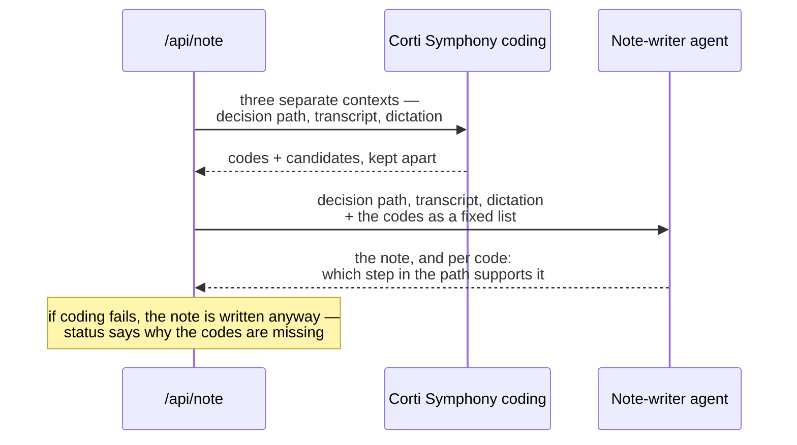

# CoSurg

One field. The clinician says what they are looking at, and the app works out what
kind of help that was. Built on the Corti API for Corti Hack for Health, August 2026.

Everything enters through the same field, spoken or typed, and one of four things
comes back: a led assessment through a decision tree, a sourced answer to a clinical
question, a treatment lookup assembled from our own knowledge base — or a question
back, when the utterance can be read two ways. All clinical content lives in JSON
(`content/trees/`) or in the MCP knowledge base, never in code.

The project-level README, including a Danish version, is one level up:
[`../README.md`](../README.md).

## How an utterance is resolved

Three layers, ordered by what the mistake costs. An answer read as a question costs a
lookup and a repetition. A question read as an answer moves a clinical decision on a
false basis and leaves nothing in the result to show that it did. So the cheap,
explainable layer goes first and only decides what it is certain of.

1. **Deterministic classification in the browser** (`components/unified/intent.ts`,
   and `components/treeRouting.ts` for which pathway an utterance opens). No network,
   no latency, and it can name its own reason — "it begins with *how*", "it hit both
   pathways". Interrogatives and lookup phrasings are strong signals; a question mark
   or a leading verb are weak ones, and two weak signals weigh as one strong. Anything
   it is not certain of is returned as `unknown` and falls through.
2. **Corti's answer interpreter** (`/api/interpret`) maps the utterance onto a value
   the active node's answer schema permits, or flags doubt.
3. **Corti's intent router** (`/api/route`) is asked only when layer 1 said `unknown`
   *and* layer 2 reported doubt: was this a question rather than an answer after all?
   On a network failure it returns `unclear`, so the failure mode is a repeated
   question rather than a wrong reading.

When the utterance is genuinely two-way — "is it deep?" asked at the depth node —
neither layer decides. The clinician is asked which was meant.

**A lookup never disturbs the pathway.** The active node is not left: the lookup card
renders below the question that is still standing, and its footer states which step
the pathway is held at. The question is also removed from the transcript again, so a
question about medicine cannot end up in the note or in the coding context as a fact
about this patient.

## Corti product areas — what the code actually calls

This table was written from verified calls against the EU environment, not from
intent.

| Product area | Used? | Where | How |
|---|---|---|---|
| **Ambient speech-to-text** | Yes | `lib/audio/useTranscribe.ts` | `/transcribe` websocket via `@corti/sdk`, `automaticPunctuation`, interim results. Listens from the first utterance in the field and on through the assessment. |
| **Dictation speech-to-text** | Yes | `lib/audio/useDictation.ts` | The same `/transcribe` socket, configured for dictation rather than ambient: `spokenPunctuation` (the clinician says "full stop", "new paragraph") and note-oriented number formatting. Wired up in `app/page.tsx`; the dictation is appended to the note. |
| **Text generation** | Yes | `app/api/note/route.ts` | The clinical note is written by a Corti agent from the decision path, the transcript and the dictation. |
| **Agentic framework** | Yes | `lib/corti/agent.ts` | Four agents with schema connectors and structured output: answer interpreter (flags doubt instead of guessing) and note writer here, plus an intent router (`app/api/route/agent.ts`) and a guide topic router (`app/api/guide/route.ts`). |
| **Medical coding** | Yes | `lib/corti/coding.ts`, `app/api/coding/route.ts` | Corti Symphony, `POST /v2/tools/coding/`. The codes come from the coding API — the language model may only justify them. |

### Caveats we are not hiding

- **SKS (Danish ICD-10) is not available to us.** Corti documents SKS
  (`/coding/icd-10-dk`), but it is early alpha for selected partners. Every
  Danish system name was rejected with a 400 ("`sks`", "`sks-diagnosis`",
  "`icd10dk`", "`icd10dk-inpatient`", "`icd10dk-outpatient`", "`icd10-dk`"). We
  therefore use `icd10int-outpatient` — international ICD-10, of which the SKS
  diagnosis set is a Danish extension. The day we are granted access,
  `CORTI_CODING_SYSTEM=…` is set and nothing else has to change.
- **Voice commands in dictation are configured but not active.** Corti replies
  `CONFIG_ACCEPTED` while marking every command `"registered": false` for our
  tenant — in English too, and with single words. We therefore do not claim that
  voice commands work.
- **TTS is not Corti.** Speech output goes through Syv.ai (Plapre, Danish,
  EU-hosted) with a fallback to the browser's own voice. The hackathon rules
  explicitly permit external TTS models.
- **The OR voice commands are not an agent.** `COMMAND_SPEC` exists in
  `lib/corti/agent.ts`, but nothing calls it. "Next", "repeat" and "back" are
  matched by deterministic rules in `components/voiceCommands.ts` instead — an
  agent round trip costs 1–2 seconds, it fails when the network does, and a rule
  is easier to keep conservative than a model when background conversation must
  never trigger a command. The spec stays as a documented upgrade path for the
  day the command set becomes a language rather than a set of buttons.

## Medical coding — why it is set up this way

An earlier version let the note-writing agent invent ICD-10 codes itself. A
language model can produce a code that looks right and does not exist. Now:

1. The decision path, the transcript and the dictation are sent as **three
   separate contexts** to `/v2/tools/coding/`, so the evidence can be traced to
   the right source.
2. Machine values (`partial-deep`) are first translated into the clinical labels
   from the tree (`Partiel dyb (2. grad)`) — the coding model reads clinical
   text, not our internal enum values.
3. Corti returns `codes` (to be coded) and `candidates` (relevant, optional).
   They are kept apart all the way out into the UI.
4. The note-writing agent receives the codes as a fixed list and may only write
   **which step in the decision path supports each code**. It cannot add, change
   or reformat a code.



If the coding call fails, the note is written anyway: a note without codes is
usable, a note with invented codes is not.

### Stability — measured, not assumed

The coding model is not deterministic. Five identical calls to `/api/note` with a
fully completed decision path:

```
status=ok attempts=1 codes=['T20.2', 'X09']
status=ok attempts=1 codes=['T20.2', 'X09']
status=ok attempts=1 codes=['T20.2', 'T30.2', 'T59.8']
status=ok attempts=1 codes=['T20.2', 'J68.2']
status=ok attempts=1 codes=['T20.2', 'T59.8']
```

The principal diagnosis `T20.2` (second-degree burn of head and neck) is hit 5
times out of 5. The secondary codes vary, but all are clinically defensible for
the same encounter. Empty responses occurred only with thin context, hence:

- **If the decision path is not complete**, the API is not called at all.
  `status: "insufficient-context"`, with a finished sentence in `coding.message`.
- **If Corti answers empty**, the API is called once more automatically
  (`attempts: 2`). If it is still empty: `status: "empty"`.
- **If the call fails or times out**: `status: "error"`, with the technical cause
  in `coding.detail`.

`coding.message` is a finished clinical sentence in the user's language. The UI
shows it instead of an empty code field — an empty field with no explanation
cannot be told apart from "the system did not answer".

Every outbound Corti call has a timeout (`lib/corti/auth.ts`: auth 10 s, coding
25 s, agent 60 s), so a demo hit by an outage fails visibly instead of hanging.

### Evidence text is repaired locally

Corti echoes `evidence.text` back as UTF-8 bytes read as latin-1, so Danish
characters return as `flammeforbrænding`. The `start`/`end` values, by contrast,
are correct character offsets. We therefore cut the excerpt out of our own input
text rather than using Corti's echo (`lib/corti/coding.ts`).

## Dictation vs. ambient — the measured difference

Both modes use `/transcribe`, but the configuration makes them two different
products. Same Danish audio clip, two configurations, actual responses from the
API:

| Configuration | Result |
|---|---|
| `automaticPunctuation` (ambient) | `… patienten er 42 har **komma** … **punktum** **nyt afsnit**.` — the punctuation words end up as text in the note. |
| `spokenPunctuation` (dictation) | `…, patienten er 42 har.` plus a line break — the words become punctuation marks and are removed from the text. |

(Word recognition is poor in the table because the test audio is synthetic
speech; what is being demonstrated is the punctuation mechanism.)

## API routes

The four outcomes of an utterance are served by four of these routes: `/api/interpret`
advances a pathway, `/api/chat` answers a clinical question, `/api/guide` fetches a
treatment, and `/api/route` is what keeps the app from having to guess which of them
was meant.

| Route | Method | Purpose |
|---|---|---|
| `/api/tree` | GET | Decision trees |
| `/api/corti/token` | GET | Short-lived token scoped `openid transcribe` for the browser |
| `/api/interpret` | POST | Spoken answer → permitted tree value (agent) |
| `/api/route` | POST | Intent routing for an utterance the deterministic layer in the browser did not dare decide: answer, question, pathway or unclear (agent) |
| `/api/note` | POST | Clinical note + codes |
| `/api/coding` | GET/POST | Standalone coding of clinical text |
| `/api/chat` | GET/POST | The question lookup: Corti's agentic framework with our MCP server attached as a connector. Each answer carries an evidence label and its sources, marked as knowledge base or literature. GET reports which Corti experts are actually attached, so the UI can be honest about it. |
| `/api/guide` | POST | The treatment lookup, assembled from the MCP knowledge base. A topic agent first normalises the clinician's question into Danish clinical search terms; if that call fails, the route falls back to the clinician's own words — worse, but never wrong. |
| `/api/pitfalls` | GET/POST | Pitfalls, each carrying a verbatim excerpt from the MCP knowledge base as backing. POST matches pitfalls to the current context (tree, node, disposition or topic); GET returns the whole catalogue. |
| `/api/tts` | POST | Danish speech output (Syv.ai) |

Every paid route sits behind `guard()` in `lib/guard.ts` — an origin lock plus a
per-IP, per-route quota over a 60-second window. The length cap is the separate
`cap()` helper, applied to all free text before it is sent to a paid API
(`LIMITS`: utterance 600, transcript 20 000, dictation 5 000, TTS 500 characters).
`/api/tree` is the one route without a guard: it only reads local files.
`/api/guide`, `/api/pitfalls` and `/api/chat` answer 503 when `MCP_URL` and
`MCP_AUTH_TOKEN` are absent, rather than falling back to general knowledge.

## Getting started

```bash
cp .env.example .env.local   # fill in CORTI_CLIENT_ID / CORTI_CLIENT_SECRET
npm install
npm run dev
```

| Environment variable | Default | Note |
|---|---|---|
| `CORTI_ENVIRONMENT` | `eu` | `eu` or `us` |
| `CORTI_TENANT` | `base` | Used in both the auth URL and the `Tenant-Name` header |
| `CORTI_CLIENT_ID` / `CORTI_CLIENT_SECRET` | — | From the Corti Console |
| `CORTI_CODING_SYSTEM` | `icd10int-outpatient` | Set to an SKS system name once access is granted |
| `SYV_API_KEY` | — | Without a key, spoken output falls back to the browser's built-in voice |
| `MCP_URL` / `MCP_AUTH_TOKEN` | — | Without them the guide, pitfalls and clinical chat are disabled |
| `ALLOWED_ORIGINS` | — | Comma-separated, for preview deployments |
