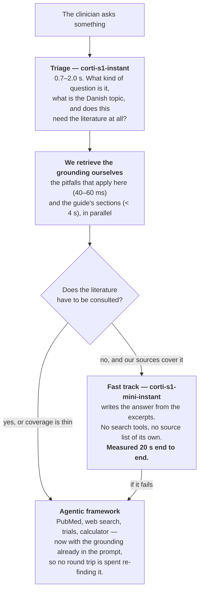
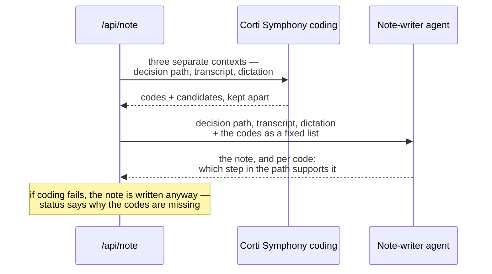

# CoSurg

One field. The clinician says what they are looking at, and the app works out what
kind of help that was. Built on the Corti API for Corti Hack for Health, August 2026.

Everything enters through the same field, spoken or typed, and one of four things
comes back: a led assessment through a decision tree, a sourced answer to a clinical
question, a treatment lookup assembled from our own knowledge base — or a question
back, when the utterance can be read two ways. All clinical content lives in JSON
(`content/trees/`) or in the MCP knowledge base, never in code.

The project-level README, including a Danish version, is one level up:
[`../README.md`](../README.md).

## How an utterance is resolved

Three layers, ordered by what the mistake costs. An answer read as a question costs a
lookup and a repetition. A question read as an answer moves a clinical decision on a
false basis and leaves nothing in the result to show that it did. So the cheap,
explainable layer goes first and only decides what it is certain of.

1. **Deterministic classification in the browser** (`components/unified/intent.ts`,
   and `components/treeRouting.ts` for which pathway an utterance opens). No network,
   no latency, and it can name its own reason — "it begins with *how*", "it hit both
   pathways". Interrogatives and lookup phrasings are strong signals; a question mark
   or a leading verb are weak ones, and two weak signals weigh as one strong. Anything
   it is not certain of is returned as `unknown` and falls through.
2. **Corti's answer interpreter** (`/api/interpret`) maps the utterance onto a value
   the active node's answer schema permits, or flags doubt.
3. **Corti's intent router** (`/api/route`) is asked only when layer 1 said `unknown`
   *and* layer 2 reported doubt: was this a question rather than an answer after all?
   It now runs on Corti Models (`corti-s1-instant`) rather than the agentic
   framework — classifying one sentence needs neither retrieval nor tools, so the
   agent round trip was pure waiting, and it was waiting at the worst possible
   moment. The agent remains as the fallback if the Models call does not land.
   On a network failure it returns `unclear`, so the failure mode is a repeated
   question rather than a wrong reading.

When the utterance is genuinely two-way — "is it deep?" asked at the depth node —
neither layer decides. The clinician is asked which was meant.

**A lookup never disturbs the pathway.** The active node is not left: the lookup card
renders below the question that is still standing, and its footer states which step
the pathway is held at. The question is also removed from the transcript again, so a
question about medicine cannot end up in the note or in the coding context as a fact
about this patient.

## Corti product areas — what the code actually calls

This table was written from verified calls against the EU environment, not from
intent.

| Product area | Used? | Where | How |
|---|---|---|---|
| **Ambient speech-to-text** | Yes | `lib/audio/useTranscribe.ts` | `/transcribe` websocket via `@corti/sdk`, `automaticPunctuation`, interim results. Listens from the first utterance in the field and on through the assessment. |
| **Dictation speech-to-text** | Yes | `lib/audio/useDictation.ts` | The same `/transcribe` socket, configured for dictation rather than ambient: `spokenPunctuation` (the clinician says "full stop", "new paragraph") and note-oriented number formatting. Wired up in `app/page.tsx`; the dictation is appended to the note. |
| **Text generation** | Yes | `app/api/note/route.ts` | The clinical note is written by a Corti agent from the decision path, the transcript and the dictation. |
| **Agentic framework** | Yes | `lib/corti/agent.ts` | Five agents with schema connectors and structured output: answer interpreter (flags doubt instead of guessing) and note writer here, an intent router (`app/api/route/agent.ts`), a guide topic router (`app/api/guide/route.ts`), and the clinical lookup agent (`lib/corti/chat.ts`) with Corti's registry experts and our own MCP server as connectors. `COMMAND_SPEC` is a sixth spec that is deliberately not called — see below. |
| **Medical coding** | Yes | `lib/corti/coding.ts`, `app/api/coding/route.ts` | Corti Symphony, `POST /v2/tools/coding/`. The codes come from the coding API — the language model may only justify them. |
| **Corti Models** | Yes | `lib/corti/models.ts`, `lib/corti/triage.ts`, `lib/corti/fastAnswer.ts`, `lib/corti/vision.ts` | Corti's own LLMs on the OpenAI-compatible endpoint `https://ai.eu.corti.app/v1`. `corti-s1-instant` triages an utterance and routes intent; `corti-s1-mini-instant` writes the fast answer from excerpts we retrieved ourselves, and describes attached wound photographs (verified: it accepts `image_url` data URIs; `corti-s1-instant` rejects them with a 400, so triage stays text-only). Used by `/api/triage`, `/api/route` and `/api/chat`. |

### Two tracks, and what decides between them

An answer through the agentic framework takes a measured 35–72 seconds, because
the agent fans out to PubMed, web search and our own knowledge base for *every*
question — including the ones our own Danish sources answer in full. Corti Models
decides in 0.7–2.0 seconds whether that round trip is needed.



**The grounding goes into the prompt, not into tools the agent may call.** Three
reasons, and the first is the one that matters: a pitfall the agent might decide
not to look up is not a safety feature. The second is latency — every tool call
is another round trip on top of the 35–72 seconds. The third is provenance: we
know an excerpt came from the knowledge base, so we mark it `knowledge-base`
ourselves instead of hoping the model marks it correctly.

On the fast track the model is handed a fixed set of excerpts, has no search
tools, and writes no source list — the list is built from the excerpts *we*
retrieved. A fabricated source is therefore not possible on that track. Anything
the model concludes beyond the excerpts goes in `reasoning`, and the answer is
labelled `sourced`, `partial` or `extrapolated` exactly as before.

**Wound photographs** (up to 4 × 8 MB, enforced server-side in
`lib/corti/vision.ts`) are described first — cautiously: colour, demarcation,
blisters, what can be seen — and never diagnosed. The description states
explicitly what a photograph cannot establish: burn depth takes capillary refill
and sensation testing, which no image contains. The observations are
model-generated and carry no source, so they are treated as reasoning all the
way through: they feed the triage, they go to both answer tracks marked *NOT a
source*, and they can never make an answer `sourced`. The fast track's model
additionally sees the photos themselves; the agentic track cannot accept images
and gets the observation text. If the analysis fails, the stream says so
(`vision`, `ok: false`) instead of silently ignoring the photo. Verified with a
synthetic test image: the model itself noted it was a graphic, not skin, and the
answer came back `extrapolated` and declined clinical assessment.

Verified against production sources: *"hvordan behandler jeg en dyb dermal
forbrænding på hånden?"* now answers, unprompted, that the dressing must not
stiffen the hand, that oedema threatens perfusion in a circumferential injury,
and that depth is only settled at the follow-up — `evidence: "sourced"` with
seven knowledge-base citations, in 20 seconds instead of 56.

### The workup runs in the conversation

The decision trees stopped being a screen and became the agent's protocol
(`lib/corti/workup.ts`). A patient description — *"50-årig mand med brandsår på
hele armen"* — never switches views. Instead:

1. **Everything already said is read out first.** One Models call maps the
   description onto the tree's answer schemas — only what is stated explicitly,
   never inferred: "brandsår" is not a mechanism, "hele armen" is not a TBSA
   percentage, and absence of a mention is never a "no". Verified: that
   utterance prefills only the location, and the first question asked is the
   mechanism — not the age, not the arm.
2. **The missing questions are asked one at a time in the chat**, in the tree's
   clinical order. Answers given early ("hele armen") that the walk has not
   reached yet are carried as `pending` and consumed automatically when it gets
   there — the clinician is never asked about something already said.
3. **Where the walk lands is decided by the tree engine alone.** The model only
   translates words into a value the node's schema already permits; the value is
   validated against the schema before the engine sees it, and the client-held
   state is replayed through the engine on every turn, so a tampered path is
   rejected. Red flags interrupt in the stream with the tree's own message,
   source and phone number; the disposition comes from the edges, never from
   the model, and arrives with the path and an offer to write the note
   (`/api/note`, codes from Corti's coding API as before).
4. **Lookups still work mid-workup.** A question pauses the walk (`phase:
   "held"`), gets the full grounded answer with the patient context built from
   the replayed path, and the workup stands at its question.

Measured: tree choice 1.2 s, each turn 0.5–0.6 s, the whole eight-node burns
workup conversationally to a deterministic disposition with no question asked
twice.

### Caveats we are not hiding

- **SKS (Danish ICD-10) is not available to us.** Corti documents SKS
  (`/coding/icd-10-dk`), but it is early alpha for selected partners. Every
  Danish system name was rejected with a 400 ("`sks`", "`sks-diagnosis`",
  "`icd10dk`", "`icd10dk-inpatient`", "`icd10dk-outpatient`", "`icd10-dk`"). We
  therefore use `icd10int-outpatient` — international ICD-10, of which the SKS
  diagnosis set is a Danish extension. The day we are granted access,
  `CORTI_CODING_SYSTEM=…` is set and nothing else has to change.
- **Voice commands in dictation are configured but not active.** Corti replies
  `CONFIG_ACCEPTED` while marking every command `"registered": false` for our
  tenant — in English too, and with single words. We therefore do not claim that
  voice commands work.
- **TTS is not Corti.** Speech output goes through Syv.ai (Plapre, Danish,
  EU-hosted) with a fallback to the browser's own voice. The hackathon rules
  explicitly permit external TTS models.
- **The OR voice commands are not an agent.** `COMMAND_SPEC` exists in
  `lib/corti/agent.ts`, but nothing calls it. "Next", "repeat" and "back" are
  matched by deterministic rules in `components/voiceCommands.ts` instead — an
  agent round trip costs 1–2 seconds, it fails when the network does, and a rule
  is easier to keep conservative than a model when background conversation must
  never trigger a command. The spec stays as a documented upgrade path for the
  day the command set becomes a language rather than a set of buttons.

## Medical coding — why it is set up this way

An earlier version let the note-writing agent invent ICD-10 codes itself. A
language model can produce a code that looks right and does not exist. Now:

1. The decision path, the transcript and the dictation are sent as **three
   separate contexts** to `/v2/tools/coding/`, so the evidence can be traced to
   the right source.
2. Machine values (`partial-deep`) are first translated into the clinical labels
   from the tree (`Partiel dyb (2. grad)`) — the coding model reads clinical
   text, not our internal enum values.
3. Corti returns `codes` (to be coded) and `candidates` (relevant, optional).
   They are kept apart all the way out into the UI.
4. The note-writing agent receives the codes as a fixed list and may only write
   **which step in the decision path supports each code**. It cannot add, change
   or reformat a code.



If the coding call fails, the note is written anyway: a note without codes is
usable, a note with invented codes is not.

### Stability — measured, not assumed

The coding model is not deterministic. Five identical calls to `/api/note` with a
fully completed decision path:

```
status=ok attempts=1 codes=['T20.2', 'X09']
status=ok attempts=1 codes=['T20.2', 'X09']
status=ok attempts=1 codes=['T20.2', 'T30.2', 'T59.8']
status=ok attempts=1 codes=['T20.2', 'J68.2']
status=ok attempts=1 codes=['T20.2', 'T59.8']
```

The principal diagnosis `T20.2` (second-degree burn of head and neck) is hit 5
times out of 5. The secondary codes vary, but all are clinically defensible for
the same encounter. Empty responses occurred only with thin context, hence:

- **If the decision path is not complete**, the API is not called at all.
  `status: "insufficient-context"`, with a finished sentence in `coding.message`.
- **If Corti answers empty**, the API is called once more automatically
  (`attempts: 2`). If it is still empty: `status: "empty"`.
- **If the call fails or times out**: `status: "error"`, with the technical cause
  in `coding.detail`.

`coding.message` is a finished clinical sentence in the user's language. The UI
shows it instead of an empty code field — an empty field with no explanation
cannot be told apart from "the system did not answer".

Every outbound Corti call has a timeout (`lib/corti/auth.ts`: auth 10 s, coding
25 s, agent 60 s), so a demo hit by an outage fails visibly instead of hanging.

### Evidence text is repaired locally

Corti echoes `evidence.text` back as UTF-8 bytes read as latin-1, so Danish
characters return as `flammeforbrænding`. The `start`/`end` values, by contrast,
are correct character offsets. We therefore cut the excerpt out of our own input
text rather than using Corti's echo (`lib/corti/coding.ts`).

## Dictation vs. ambient — the measured difference

Both modes use `/transcribe`, but the configuration makes them two different
products. Same Danish audio clip, two configurations, actual responses from the
API:

| Configuration | Result |
|---|---|
| `automaticPunctuation` (ambient) | `… patienten er 42 har **komma** … **punktum** **nyt afsnit**.` — the punctuation words end up as text in the note. |
| `spokenPunctuation` (dictation) | `…, patienten er 42 har.` plus a line break — the words become punctuation marks and are removed from the text. |

(Word recognition is poor in the table because the test audio is synthetic
speech; what is being demonstrated is the punctuation mechanism.)

## API routes

The four outcomes of an utterance are served by four of these routes: `/api/interpret`
advances a pathway, `/api/chat` answers a clinical question, `/api/guide` fetches a
treatment, and `/api/route` is what keeps the app from having to guess which of them
was meant.

| Route | Method | Purpose |
|---|---|---|
| `/api/tree` | GET | Decision trees |
| `/api/corti/token` | GET | Short-lived token scoped `openid transcribe` for the browser |
| `/api/interpret` | POST | Spoken answer → permitted tree value (agent) |
| `/api/route` | POST | Intent routing for an utterance the deterministic layer in the browser did not dare decide: answer, question, pathway or unclear. Corti Models first, the agent as fallback; the response now carries `routedBy` saying which answered |
| `/api/triage` | POST | What does the clinician want, does this need the literature, and what are the Danish search terms — one Corti Models call, 0.7–2.0 s. The same triage `/api/chat` runs internally, exposed so the UI can show the topic while the heavy answer is still being fetched |
| `/api/note` | POST | Clinical note + codes. With `epic: true` (+ `anamnese` from the workup) the response also carries `epicNote`: Rigshospitalet's AOP admission template (`content/templates/aop-brandsaar.txt`) filled deterministically — Epic codes preserved verbatim, known values inserted, everything unknown left as `***`, conditional blocks (DM, tourniquet, child vaccination) included only when the workup actually found the condition, and Parkland computed in code (3 ml × kg × TBSA%) with its source. A model never touches the template. |
| `/api/coding` | GET/POST | Standalone coding of clinical text |
| `/api/chat` | GET/POST | The question lookup — and the conversational workup. POST triages with Corti Models, retrieves the applicable pitfalls and the guide's sections itself, and then either writes the answer from those excerpts (fast track) or hands them to the agentic framework along with the question. Accepts `images` (≤ 4 × 8 MB, plain base64, jpeg/png/webp/heic) — described before triage, observations marked as reasoning, never as a source. A patient description starts a workup instead (see below); an ongoing workup is carried by the client as `workup: {treeId, path, pending}`. Each answer carries an evidence label and its sources. Additive SSE events: `triage`, `pitfalls`, `vision`, `workup`, `redflag`, `disposition`, `noteOffer`. Pass `fastPath: false` to force the agentic track. GET reports which Corti experts are actually attached. |
| `/api/guide` | POST | The treatment lookup, assembled from the MCP knowledge base. A topic agent first normalises the clinician's question into Danish clinical search terms; if that call fails, the route falls back to the clinician's own words — worse, but never wrong. |
| `/api/pitfalls` | GET/POST | Pitfalls, each carrying a verbatim excerpt from the MCP knowledge base as backing. POST matches pitfalls to the current context (tree, node, disposition or topic); GET returns the whole catalogue. |
| `/api/tts` | POST | Danish speech output (Syv.ai) |

Every paid route sits behind `guard()` in `lib/guard.ts` — an origin lock plus a
per-IP, per-route quota over a 60-second window. The length cap is the separate
`cap()` helper, applied to all free text before it is sent to a paid API
(`LIMITS`: utterance 600, transcript 20 000, dictation 5 000, TTS 500 characters).
`/api/tree` is the one route without a guard: it only reads local files.
`/api/guide` and `/api/pitfalls` answer 503 when `MCP_URL` and `MCP_AUTH_TOKEN`
are absent, rather than falling back to general knowledge; `/api/chat` then runs
without grounding and lets the literature experts answer, which is the one place
where a source outside our own base is the right fallback. `/api/triage` answers
503 without `CORTI_MODELS_KEY`.

## Getting started

```bash
cp .env.example .env.local   # fill in CORTI_CLIENT_ID / CORTI_CLIENT_SECRET
npm install
npm run dev
```

| Environment variable | Default | Note |
|---|---|---|
| `CORTI_ENVIRONMENT` | `eu` | `eu` or `us` |
| `CORTI_TENANT` | `base` | Used in both the auth URL and the `Tenant-Name` header |
| `CORTI_CLIENT_ID` / `CORTI_CLIENT_SECRET` | — | From the Corti Console |
| `CORTI_CODING_SYSTEM` | `icd10int-outpatient` | Set to an SKS system name once access is granted |
| `CORTI_MODELS_KEY` | — | Corti Models. Without it, `/api/triage` answers 503, `/api/route` falls back to the agent, and `/api/chat` always takes the slow agentic track |
| `CORTI_MODELS_URL` | `https://ai.eu.corti.app/v1` | OpenAI-compatible endpoint |
| `CORTI_MODELS_TRIAGE` / `CORTI_MODELS_SYNTHESIS` | `corti-s1-instant` / `corti-s1-mini-instant` | The `-instant` variants are not cosmetic: on the same prompt `corti-s1-mini` spent 26 s reasoning and ran out of tokens without returning a byte of content, while `corti-s1-mini-instant` finished in 5 s |
| `SYV_API_KEY` | — | Without a key, spoken output falls back to the browser's built-in voice |
| `MCP_URL` / `MCP_AUTH_TOKEN` | — | Without them the guide, pitfalls and clinical chat are disabled |
| `ALLOWED_ORIGINS` | — | Comma-separated, for preview deployments |
